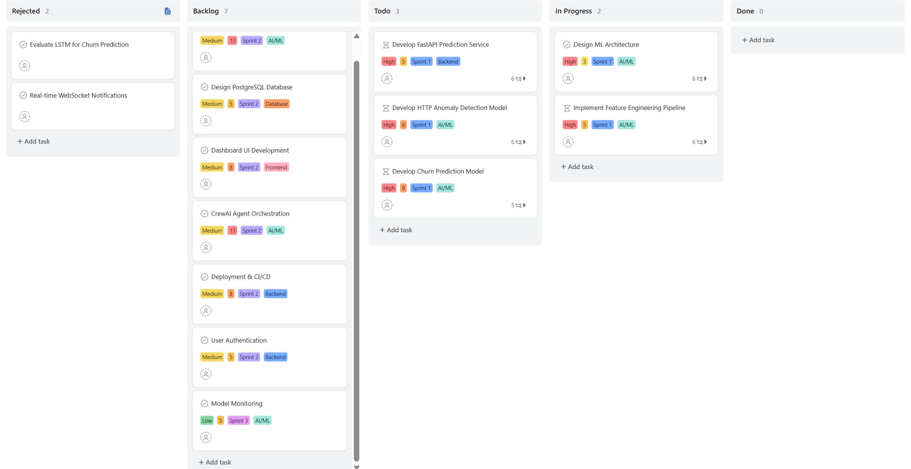
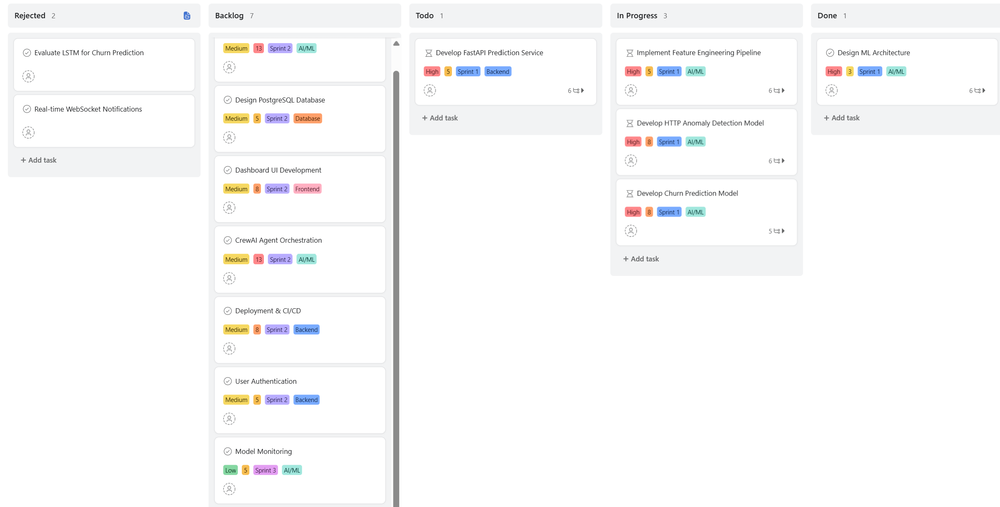
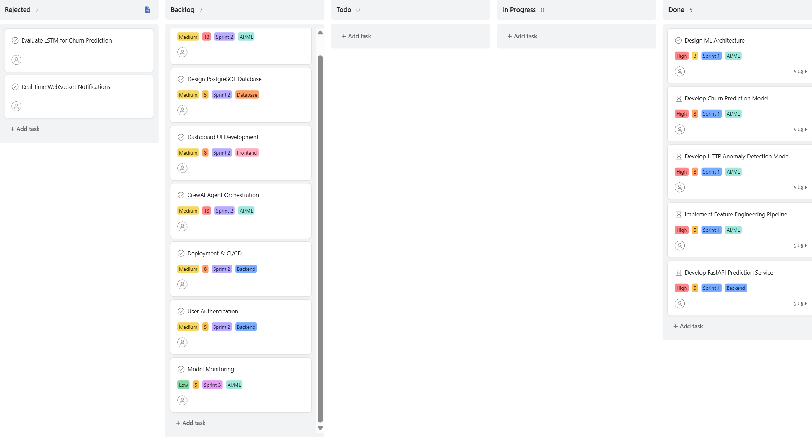
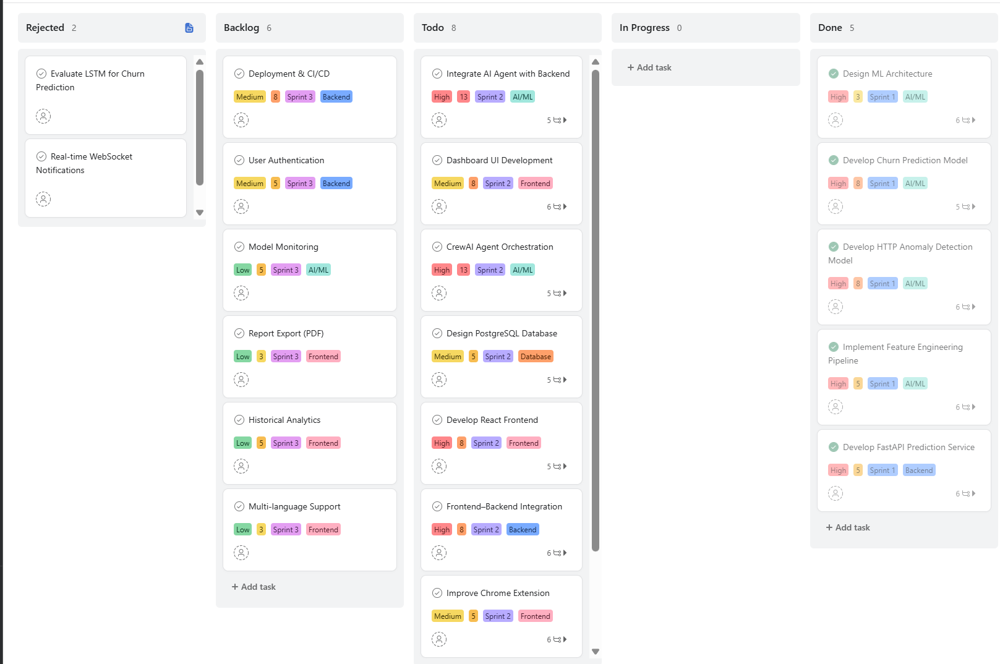
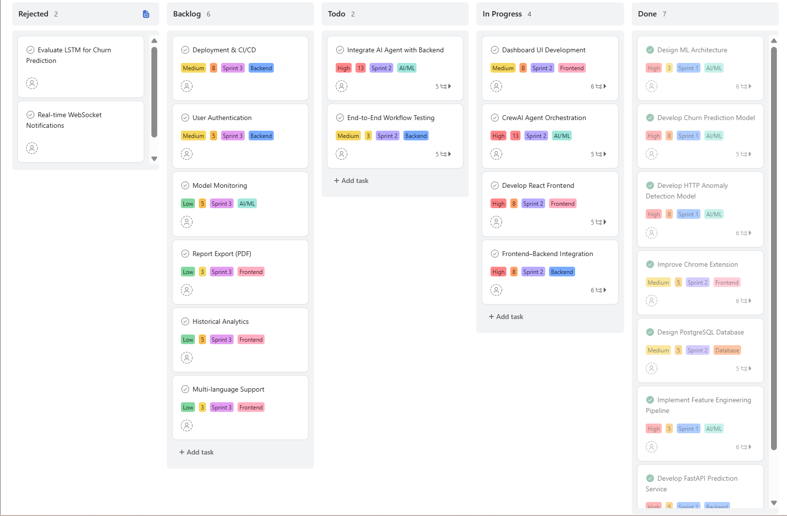
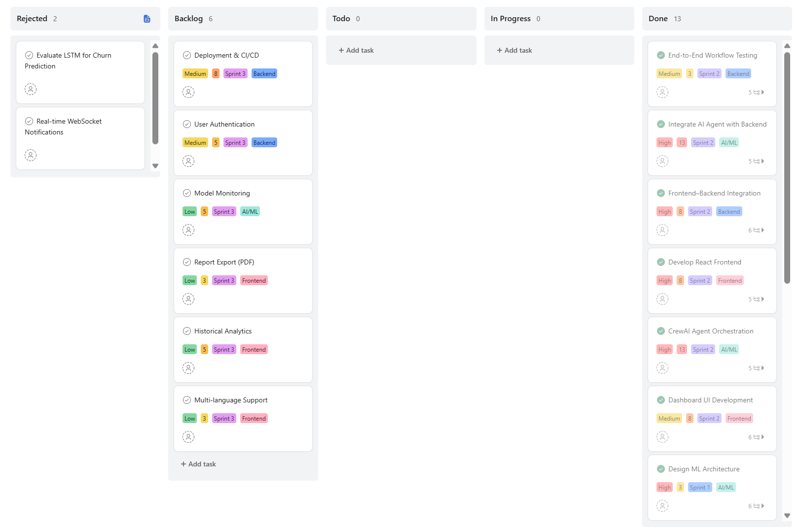

# YZTA-BOOTCAMP-2026
# **Takım İsmi**

[TAKIM 38]

# Ürün İle İlgili Bilgiler

## Takım Elemanları

* Serenay Nebahat Duran: Product Owner
* Burak Arabacıoğlu: Scrum Master
* Eda Yamak: Team Member/Developer
* Hilal Hanım Keskin: Team Member/Developer
* Ömer Faruk Keskin: Team Member/Developer

## Ürün İsmi

AgenticQA

## Ürün Açıklaması

AgenticQA, e-ticaret sayfalarındaki UX hatalarını, güven sinyali eksiklerini ve sepet terk (churn) riskini tespit eden B2B SaaS platformudur.

Sistem üç katmandan oluşur:

1. **Chrome eklentisi** — Mağaza sayfasını tarar; canlı HTML, CSS, sepet ve metrikleri toplar.
2. **Backend (FastAPI + CatBoost)** — Eklenti verisini alır, `capture_id` üretir, ML skoru hesaplar.
3. **Admin konsol** *(yol haritası)* — Detaylı analiz, AI konsey yorumu ve HTML/CSS düzeltme önerileri burada sunulur.

Mağaza sahibi sitedeyken eklentide **Siteyi Tara** der. Popup yalnızca kısa özet gösterir (site, ön risk, paket boyutu); asıl inceleme admin konsolunda yapılır. JavaScript kaynak kodu okunmaz; kişisel veri toplanmaz.

Toplanan veri üç **analiz hattına** ayrılır: **Güven**, **UX / Churn**, **Satış Hunisi**. Her hat için risk skoru üretilir (0 = iyi, 100 = kötü). Persona simülasyonu (Aceleci Alışverişçi, Erişilebilirlik Hassas Kullanıcı, Güven senaryosu) extension tarafında davranış logu olarak kaydedilir; tam AI konsey yorumu admin katmanında çalışacaktır.

## Ürün Özellikleri

* **Sıfır kod entegrasyonu:** Mağaza koduna dokunmadan Chrome eklentisi ile tek tıkla tarama; popup kapansa bile arka planda DOM/CSS toplama devam eder.
* **Üç analiz hattı:** Güven, UX/Churn ve Satış Hunisi için ayrı feature set, risk skoru ve tespit özeti.
* **Persona simülasyonu:** Üç kullanıcı senaryosu extension payload'ına `agent_simulation` olarak eklenir; backend ve admin konsol bu veriyi kullanır.
* **Canlı DOM & CSS yakalama:** Render edilmiş sayfa iskeleti, kontrast, sepet, e-ticaret sinyalleri (kargo, ödeme, sosyal kanıt) yapılandırılmış JSON olarak iletilir.
* **Backend intake + ML:** `POST /api/analyze` ile extension verisi alınır; CatBoost modelleri `/predict/anomaly` ve `/predict/churn` üzerinden anomali ve churn tahmini sunar (Sprint 1: %97.42 / %86.35 AUC).
* **Admin akışı:** Her taramaya `capture_id` atanır; kullanıcı isterse admin konsolunda detaya gider (`GET /api/capture/{capture_id}`).
* **Gizlilik:** E-posta, telefon, şifre, adres ve kart toplanmaz; hassas form alanları maskeleme kurallarıyla işlenir.
* **Admin konsey & dashboard *(yol haritası)*:** ML skorları, lane verileri, AI ajan yorumu ve Eski Hali / Yeni Hali simülasyonu.

## Repo Yapısı

```
YZTA-BOOTCAMP-2026/
├── chrome-extension/     # Veri toplayıcı (Siteyi Tara)
├── backend/              # FastAPI + CatBoost + extension intake
│   └── README.md         # Backend kurulum ve API detayı
└── README.md
```

### Modüller

| Modül | Görev | Klasör | Durum |
|-------|--------|--------|-------|
| Veri toplayıcı | Sayfa tarama, lane + persona, API'ye POST | `chrome-extension/` | ✅ |
| ML & intake API | `/api/analyze`, `/predict/*`, capture saklama | `backend/` | ✅ |
| Admin konsol | Detay, konsey, HTML/CSS düzeltme | — | ⏳ |

## Hızlı Başlangıç

**1. Backend**

```bash
cd backend
python3 -m venv .venv
source .venv/bin/activate
pip install -r requirements.txt
# models/anomaly_model.cbm ve churn_model.cbm dosyalarini backend/models/ altina koy
./run.sh
```

API: `http://127.0.0.1:8000` · Swagger: `/docs`  
Detaylı endpoint listesi → [backend/README.md](backend/README.md)

**2. Chrome eklentisi**

`chrome://extensions` → Geliştirici modu → **Paketlenmemiş öğe yükle** → `chrome-extension/` klasörünü seç.

**3. Tarama**

E-ticaret sayfasını aç → eklenti → **Siteyi Tara** → özet popup'ta görünür → **Admin konsolunda incele** (dashboard hazır olunca `capture_id` ile açılır).

## Hedef Kitle

* E-ticaret KOBİ'leri ve D2C markalar (Shopify, ikas, WooCommerce vb.)
* Pazaryeri satıcıları ve mağaza operasyon ekipleri
* UX/UI tasarımcıları ve ürün yöneticileri (Product Managers)
* QA / growth ekipleri — checkout sürtünmesi ve sepet terk oranını izleyenler
* Yazılım geliştirme ajansları (müşteri sitelerinde hızlı UX denetimi)

## Product Backlog URL

[Backlog Board Linki](https://app.asana.com/1/1216279486743436/project/1216277599548850/board/1216278202254806)

---

# Sprint 1

* **Backlog düzeni ve Story seçimleri**:

Sprint 1 kapsamında, AgenticQA platformunun temel makine öğrenmesi ve backend altyapısının oluşturulması hedeflenmiştir. Sprint planlama toplantısında Product Backlog önceliklendirilmiş ve takım kapasitesi dikkate alınarak **Fibonacci Story Point** yöntemi (3, 5, 8) ile tahminleme yapılmıştır. Story'ler, Sprint hedefini aşmayacak şekilde seçilmiş ve daha küçük yapılabilir işlere (Task/Subtask) bölünerek Asana Sprint Board üzerinde takip edilmiştir.

Sprint 1 kapsamında seçilen Story'ler aşağıdaki gibidir:

| Story | Açıklama | Story Point |
|--------|----------|------------:|
| **Design ML Architecture** | AgenticQA platformunun makine öğrenmesi mimarisinin oluşturulması, kullanılacak modellerin ve veri akışının planlanması. | **3** |
| **Implement Feature Engineering Pipeline** | Clickstream ve HTTP isteklerinden davranışsal ve güvenlik odaklı özelliklerin çıkarılması, veri ön işleme süreçlerinin geliştirilmesi. | **5** |
| **Develop Churn Prediction Model** | CatBoost tabanlı kullanıcı terk (Churn) tahmin modelinin geliştirilmesi ve model optimizasyonunun yapılması. | **8** |
| **Develop HTTP Anomaly Detection Model** | HTTP isteklerinden anormal davranışların tespit edilmesini sağlayan CatBoost tabanlı modelin geliştirilmesi. | **8** |
| **Develop FastAPI Prediction Service** | Eğitilen makine öğrenmesi modellerini REST API üzerinden servis eden FastAPI altyapısının ve tahmin endpoint'lerinin geliştirilmesi. | **5** |

Sprint süresince bu Story'ler aşağıdaki teknik görevler ile desteklenmiştir:

- CatBoost tabanlı Churn Prediction ve HTTP Anomaly Detection modellerinin geliştirilmesi
- Feature Engineering ve veri ön işleme süreçlerinin tamamlanması
- FastAPI tabanlı REST API servislerinin geliştirilmesi
- `/predict/churn` ve `/predict/anomaly` endpoint'lerinin oluşturulması
- Chrome Extension ile Backend arasındaki `/api/analyze` veri akışının hazırlanması
- Extension tarafından gönderilen analiz kayıtları için `capture_id` yapısının oluşturulması

Sprint sonunda planlanan Story'lerin tamamı başarıyla tamamlanmış ve Sprint hedeflerine ulaşılmıştır.

* **Daily Scrum**:
* Sprint boyunca haftada 3 gün, 15'er dakikalık Daily Scrum toplantıları yapılmıştır. 
* Öne Çıkan Gelişmeler: 
* - Veri bilimi bacağında CatBoost modellerinin %97.42 (Anomali) ve %86.35 (Churn) AUC başarı metriklerine ulaşmasıyla ilk büyük milat tamamlanmıştır. Geliştirme ekibi tarafında AgenticQA Chrome eklentisi (v1.8.4) ile modüler FastAPI backend intake katmanı tamamlanmış; eklenti `POST /api/analyze` üzerinden tarama paketini backend'e iletebilir hale gelmiştir.
* - Karşılaşılan Engeller (Impediments): Google Colab ile Drive arasındaki dosya yazma/okuma senkronizasyon problemleri ve Uvicorn'un arka planda modelleri yüklerken test isteklerinde fırlattığı Connection refused hataları takımı kısa süreli bloke etmiştir. Eklenti tarafında Uvicorn `--reload` döngüsü (`.venv` izleme) ve service worker'da config destructuring kaynaklı tarama hataları giderilmiştir.

* - Sprint 1 süresince gerçekleştirilen Daily Scrum toplantılarından örnek ekran görüntülerine aşağıdaki bağlantıdan ulaşılabilir.

- **Sprint 1 Daily Scrum Kayıtları:** [DailyScrum](images/daily_scrum)
 
* **Sprint board update**: 
* Sprint boyunca Product Backlog Item'ları planlandığı şekilde Asana Sprint Board üzerinde takip edilmiştir. Sprint ilerledikçe Story'ler **Backlog → To Do → In Progress → Done** akışı doğrultusunda güncellenmiş ve tamamlanan geliştirmeler Sprint Board üzerinden izlenmiştir.
* Sprint sonunda AgenticQA platformunun ilk çalışan **Product Increment**'i başarıyla oluşturulmuştur. Geliştirilen FastAPI tabanlı servisler ile Chrome Extension arasındaki veri akışı tamamlanmış, makine öğrenmesi modelleri REST API üzerinden erişilebilir hale getirilmiştir.
* Sprint board screenshotları:
<p align="center">
  
</p>
<p align="center">
  
</p>
<p align="center">
  
</p>

* **Sprint Başlangıcı**

* - Sprint Planlama toplantısında seçilen Story'ler Story Point değerleriyle önceliklendirilerek **To Do** ve **In Progress** sütunlarına taşındı.
* - Sprint 2 ve Sprint 3 kapsamında geliştirilecek özellikler Product Backlog içerisinde bırakıldı.


* **Sprint Ortası**

* - Machine Learning Architecture ve Feature Engineering çalışmaları büyük ölçüde tamamlandı.
* - Churn Prediction ve HTTP Anomaly Detection modellerinin geliştirilmesi planlandığı şekilde ilerledi.
* - Chrome Extension ile Backend arasındaki entegrasyon çalışmaları başlatıldı.


* **Sprint Sonu**
* - Sprint kapsamında taahhüt edilen tüm Story'ler başarıyla tamamlanarak **Done** sütununa taşındı.
* - CatBoost tabanlı **Churn Prediction** ve **HTTP Anomaly Detection** modelleri başarıyla geliştirildi.
* - FastAPI tabanlı REST API servisleri tamamlandı ve `/predict/churn` ile `/predict/anomaly` endpoint'leri çalışır duruma getirildi.
* - Chrome Extension tarafından üretilen analiz verilerinin `/api/analyze` endpoint'i üzerinden Backend'e iletilmesi başarıyla sağlandı.
* - Oluşturulan `capture_id` yapısı sayesinde analiz kayıtlarının Admin Dashboard tarafında kullanılabilecek şekilde saklanması için gerekli altyapı hazırlandı.


* **Geliştirme ekibi — teslim edilenler (Extension + Backend intake)**:

  **Chrome eklentisi (`chrome-extension/`, v1.8.4)**
  * Manifest V3 service worker; popup kapansa bile arka planda tarama devam eder.
  * Canlı sayfa yakalama: DOM iskeleti, CSS özeti, sepet, e-ticaret sinyalleri (kargo/ödeme/güven), kontrast ve UX metrikleri.
  * PII maskeleme: e-posta, telefon, şifre, adres ve kart alanları toplanmaz.
  * **Üç analiz hattı:** Güven · UX/Churn · Satış Hunisi — her biri için feature set, risk skoru (0 = iyi, 100 = kötü) ve tespit özeti.
  * **Persona simülasyonu:** Aceleci Alışverişçi, Erişilebilirlik Hassas Kullanıcı, Kötü Niyetli Saldırgan — payload'a `agent_simulation` olarak eklenir.
  * Tarama pipeline: hızlı metrikler → persona → ağır DOM/CSS → `POST http://localhost:8000/api/analyze`.
  * Sade popup: Site / platform, sayfa tipi, ön risk, paket boyutu, `capture_id`; **Admin konsolunda incele** butonu.

  **Backend genişletmesi (`backend/`)**
  * Modüler FastAPI: `routers/` (health, analyze, predict), `services/` (capture, ml, feature_extraction), `schemas/`.
  * `POST /api/analyze` — eklenti verisini alır, özet + ML skoru üretir.
  * `GET /api/capture/{capture_id}` — taramayı bellekte saklar (admin konsol için).
  * Mevcut CatBoost endpoint'leri korundu: `/predict/anomaly`, `/predict/churn`.
  * `run.sh` — uvicorn reload yalnızca `app/` izler (`.venv` döngüsü giderildi).
  * Kurulum ve API dokümantasyonu: [backend/README.md](backend/README.md)

* **Ürün Durumu**: Ekran görüntüleri:


  
* **Sprint Review**: Sprint 1 hedeflerine %100 oranında ulaşılmıştır. Paydaşlara ve takım üyelerine çalışan API mimarisi sunulmuş, CatBoost modellerinin validasyon başarıları gösterilmiştir. Yapılan interaktif testlerde API'nin tıkır tıkır çalıştığı ve model dosyalarını başarıyla yüklediği doğrulanmıştır. Extension → backend intake akışı demo edilmiş; eklentinin mağaza sayfasından veri toplayıp backend'e ilettiği gösterilmiştir. Bir sonraki sprintte admin konsol/dashboard arayüzünün bu `capture_id` akışına bağlanması onaylanmıştır.

 
* **Sprint Retrospective:**
* **Ne İyi Gitti? :**
Büyük veri kümelerini chunk'lar halinde işleme stratejimiz çok başarılı oldu; RAM patlaması yaşamadan veri setini kararlı hale getirdik.
CatBoost modellerimizin validasyon başarıları (Anomali için %97.42, Churn için %86.35 AUC) hedeflediğimiz metriklerin çok üzerinde geldi.  
FastAPI entegrasyonu sayesinde backend mimarisini çok hızlı bir şekilde ayağa kaldırdık ve sorunsuz çalışan `{'status': 'ok'}` çıktısını aldık.
Chrome eklentisinde lane tabanlı analiz ve persona simülasyonu tek payload'da birleştirildi; popup sade tutularak asıl detay admin katmanına bırakıldı.
* **Ne Geliştirilebilir? :**
Google Colab'in sanal Linux dosya sistemi ve dinamik klasör yolları sunucuyu başlatırken yerel senkronizasyon gecikmelerine ve zaman kayıplarına yol açtı.  
Gelecek sprintlerde, API ayağa kaldırma ve test süreçlerini doğrudan yerel terminal ortamında (VS Code veya PyCharm üzerinden) yürüterek bulut tabanlı dosya yolu karmaşasının önüne geçebiliriz.
Capture store şu an bellekte; admin konsol gelince kalıcı depolama (DB veya dosya) eklenmeli. Admin dashboard henüz yok — Sprint 2 kapsamında.

---

# Sprint 2

### Sprint 2 Backlog Düzeni ve Story Seçimleri
Sprint 2 kapsamında AgenticQA platformunun ilk çalışan prototipinin uçtan uca entegrasyonunun sağlanması hedeflenmiştir. Sprint planlama toplantısında Product Backlog yeniden önceliklendirilmiş, Sprint 1 sonunda tamamlanan makine öğrenmesi ve backend altyapısı üzerine kullanıcı arayüzü, veri tabanı tasarımı ve AI Agent entegrasyonu çalışmalarına odaklanılmıştır. Story tahminlemelerinde Fibonacci Story Point yöntemi (3, 5, 8, 13) kullanılmış, Story'ler daha küçük Task ve Subtask'lara ayrılarak Asana Sprint Board üzerinde takip edilmiştir.

Sprint 2 kapsamında seçilen Story'ler aşağıdaki gibidir:

| Story | Açıklama | Story Point |
|--------|----------|------------:|
| Dashboard UI Development | AgenticQA analiz sonuçlarını görüntüleyebilecek React tabanlı kullanıcı arayüzünün geliştirilmesi. | 8 |
| Develop React Frontend | Frontend uygulamasının temel bileşenlerinin ve sayfa yapısının oluşturulması. | 8 |
| Frontend–Backend Integration | React uygulamasının FastAPI servisleri ile haberleşmesinin sağlanması. | 8 |
| Improve Chrome Extension | Chrome Extension'ın veri toplama ve analiz süreçlerinin geliştirilmesi. | 5 |
| Design PostgreSQL Database | Capture kayıtlarının ve analiz sonuçlarının saklanacağı PostgreSQL veri tabanı tasarımının hazırlanması. | 5 |
| CrewAI Agent Orchestration | Çok ajanlı AI mimarisinin CrewAI kullanılarak yapılandırılması. | 13 |
| Integrate AI Agent with Backend | AI Agent yapısının Backend servisleriyle entegre edilmesi. | 13 |

#### Sprint süresince Frontend bacağında desteklenen teknik görevler:
*   Tailwind CSS v4 kurulumunun tamamlanması (PostCSS entegrasyonu, `@import "tailwindcss"` eksikliğinin giderilmesi).
*   `DashboardLayout.jsx`: Sidebar, üst özet skor kartları (Genel Risk Skoru, Yapay Zeka Lane Analizi, ML Tahmin Motoru) ve hata durumu gösterimi.
*   `AgentCards.jsx`: Persona kartlarının bağımsız, yeniden kullanılabilir component olarak ayrıştırılması ve gerçek backend şemasına (`id`, `label`, `friction_score`, `would_abandon`, `events`, `findings`) bağlanması.
*   Backend'in tam capture kaydındaki `payload.agent_simulation` veri yolunun doğru şekilde okunmasını sağlayan entegrasyon düzeltmesi.
*   Kullanılmayan / Vite scaffold'undan kalma dosyaların (`App.css`, `tailwind.config.js`) temizlenmesi.
*   Frontend `README.md` dokümantasyonunun backend `README` formatıyla tutarlı şekilde yazılması.

### Daily Scrum
Sprint 2 süresince planlanan Daily Scrum toplantılarının bir kısmı takım üyelerine ulaşılamaması nedeniyle gerçekleştirilememiştir. Bu durum, Sprint Retrospective bölümünde bir impediment (engel) olarak ele alınmıştır.

### Sprint Board Update
Sprint boyunca Product Backlog Item'ları planlandığı şekilde Asana Sprint Board üzerinde takip edilmiştir. Sprint ilerledikçe Story'ler Backlog → To Do → In Progress → Done akışı doğrultusunda güncellenmiş ve tamamlanan geliştirmeler Sprint Board üzerinden izlenmiştir.

Sprint sonunda AgenticQA platformunun Frontend, Backend, Chrome Extension ve AI Agent bileşenleri birbirine entegre edilerek ilk uçtan uca çalışan sistem prototipi başarıyla oluşturulmuştur.

*   **Sprint Board Ekran Görüntüleri:**
 <p align="center">
  
</p>
 <p align="center">
  
</p>
 <p align="center">
  
</p>
*   **Ürün Durumu Ekran Görüntüleri:** *[Eklenecek]*

---

### 🚀 Ürün Durumu (Sprint Sonu)
Sprint sonunda Admin Dashboard'un ilk çalışan sürümü başarıyla tamamlanmıştır:

*   **Canlı Veri Bağlantısı:** Dashboard, URL üzerinden gelen `capture_id` ile (`/dashboard?capture_id=cap_xxx`) veya en son yapılan taramayı otomatik çekerek backend'den canlı veri okuyabilmektedir.
*   **Risk Analiz Kartları:** Genel Risk Skoru, Risk Durumu (LOW/MEDIUM/HIGH), Yapay Zeka Lane Analizi'ndeki kritik bulgu sayısı ve siteden ayrılma eğilimi kartlarda gösterilmektedir.
*   **Aktif AI Ajan Ordusu:** Bölümde üç persona simülasyonu (Aceleci Alışverişçi, Erişilebilirlik Hassas Kullanıcı, Kötü Niyetli Saldırgan) sürtünme skoru, davranış log akışı ve ajan tespitleriyle birlikte kart olarak render edilmektedir.
*   **Hata Toleransı (Resilience):** ML Tahmin Motoru kartı, backend'de CatBoost model dosyaları henüz yüklenmediğinde (`models_loaded: false`) bunu kullanıcıya açıkça bildirmekte, uygulama çökmemektedir.
*   **Gelecek Planlaması:** "Canlı Akış", "Raporlar & Loglar" ve "Ayarlar" sekmeleri Sprint 3 yol haritası olarak placeholder içerikle gösterilmektedir.
*   **Uçtan Uca Test:** Gerçek bir mağaza taraması (trendyol.com) ile uçtan uca test edilmiş; *eklenti → backend → dashboard* akışının kararlı çalıştığı doğrulanmıştır.

---

### 🔍 Sprint Review

* Sprint sonunda React tabanlı kullanıcı arayüzü, Backend servisleri ve Chrome Extension başarılı şekilde entegre edilmiştir. PostgreSQL veri tabanı tasarımı hazırlanmış, CrewAI tabanlı AI Agent mimarisi Backend ile haberleşebilir hale getirilmiştir. Gerçekleştirilen demo sırasında Extension tarafından oluşturulan analizlerin Backend üzerinden işlendiği ve Dashboard üzerinde görüntülenebildiği doğrulanmıştır. Paydaşlar tarafından sistemin temel entegrasyonunun başarılı olduğu değerlendirilmiş ve bir sonraki Sprint kapsamında Deployment, Authentication ve sistem izleme (Monitoring) çalışmalarına devam edilmesi kararlaştırılmıştır.
---

### ↩️ Sprint Retrospective

#### Ne İyi Gitti?
*   Dashboard'u backend'in gerçek yanıt şemasına (`summary`, `ml`, `payload.agent_simulation`) karşı test ederken kod incelemesi sırasında birkaç kritik entegrasyon hatası (yanlış veri yolu okuma, Tailwind'in hiç derlenmemesi, typo'lu responsive class'lar) erken yakalanıp düzeltildi.
*   Persona kartlarının ayrı bir component'e (`AgentCards.jsx`) çıkarılması kod tekrarını azalttı ve gelecekte yeniden kullanımı kolaylaştırdı.
*   Gerçek bir tarama verisiyle uçtan uca test yapılabilmesi, entegrasyonun fiilen çalıştığının erken doğrulanmasını sağladı.

#### Ne Geliştirilebilir?
*   Sprint 2 süresince takım içi iletişim ciddi şekilde aksadı — backend, ML ve Chrome Extension bacaklarındaki ilerleme bu raporun hazırlandığı tarihte teyit edilemedi ve son commit'in (Sprint 1'e ait) üzerinden yaklaşık iki hafta geçmiş olduğu görüldü. Sprint 3'e girmeden önce tüm takımın senkronize olması, güncel durumun Asana board üzerinden netleştirilmesi ve Daily Scrum'ların düzenli şekilde yapılmasının sağlanması gerekmektedir.
*   CatBoost model dosyaları (`backend/models/*.cbm`) hâlâ repo'ya eklenmemiş durumda; bu, Sprint 3'te ML Tahmin Motoru kartının gerçek tahminleri gösterebilmesi için öncelikli olarak çözülmesi gereken bir bağımlılıktır.

---

# Sprint 3

## Backlog Düzeni ve Story Seçimleri

Sprint 2 sonunda planlandığı üzere, Sprint 3 kapsamının hedefi Admin Dashboard'un yol haritasında placeholder olarak duran üç modülü (Canlı Akış, Raporlar & Loglar, Ayarlar) gerçek işlevsellikle doldurmaktı. Sprint 3 süresince de takım içi iletişim kopukluğu devam etmiş; Backend, ML ve Chrome Extension bacaklarında bu sprint kapsamında hangi Story'lerin seçildiği ve tamamlandığı yine ilgili takım üyelerinden teyit alınamamıştır. Bu nedenle Frontend geliştiricisi, gerekli olan sınırlı backend değişikliklerini (WebSocket desteği) de kendisi üstlenerek tamamlamıştır.

Fiilen tamamlanan iş aşağıdaki gibidir:

| Story | Açıklama | Durum |
| :--- | :--- | :--- |
| **Live Feed - Real-time Backend Support** | Backend'e WebSocket endpoint'i (`/api/ws/captures`) ve broadcast mekanizması (`ws_manager.py`) eklenmesi; her yeni `/api/analyze` isteğinde bağlı istemcilere anlık yayın yapılması. | **Tamamlandı** |
| **Live Feed - Frontend Integration** | Dashboard'un Canlı Akış sekmesinin gerçek WebSocket bağlantısına geçirilmesi; bağlantı durumu göstergesi, otomatik yeniden bağlanma, mükerrer kayıt engelleme. | **Tamamlandı** |
| **Reports & Logs Module** | Backend'in mevcut `GET /api/captures` ve `GET /api/capture/{id}` endpoint'lerini kullanarak geçmiş taramaların listelenmesi, tek taramaya geçiş ve JSON olarak indirme. | **Tamamlandı** |
| **Settings Panel (Scoped)** | Backend'de gerçek bir tüketicisi olmayan API anahtarı/webhook gibi sahte entegrasyonlar yerine, yalnızca gerçekten işlevsel olan ayarların (Backend adresi, Canlı Akış yenileme aralığı, tarayıcı yerel deposunda kalıcı) sunulması yönünde bilinçli bir kapsam kararı alınmıştır. | **Tamamlandı (kapsam dahilinde)** |
| **Model Dosyası Konumu Düzeltmesi** | CatBoost model dosyalarının (`anomaly_model.cbm`, `churn_model.cbm`) yanlışlıkla repo kök dizinine yüklenmiş olması tespit edilip `backend/models/` klasörüne taşınmıştır; ML Tahmin Motoru artık gerçek tahminler üretmektedir. | **Tamamlandı** |

### Sprint süresince desteklenen teknik görevler:

* `backend/app/services/ws_manager.py`: Aktif WebSocket bağlantılarını tutan ve yeni capture geldiğinde broadcast eden ConnectionManager
* `backend/app/routers/analyze.py`: `POST /api/analyze` içine broadcast çağrısı ve yeni `/api/ws/captures` WebSocket route'unun eklenmesi
* `LiveFeed.jsx`: WebSocket bağlantısı, bağlantı durumu göstergesi, otomatik yeniden bağlanma, mükerrer capture kaydı engelleme (dedup), StrictMode kaynaklı çift bağlantı sorununun giderilmesi
* `ReportsLogs.jsx`: Geçmiş taramaların tablo halinde listelenmesi, backend'in gerçek `/api/captures` yanıt şemasına (`capture_ids` alanı) uyarlanması, JSON indirme
* `SettingsPanel.jsx`: Yerel (`localStorage`) ayarlar paneli
* `DashboardLayout.jsx`: Yol haritası placeholder'larının kaldırılıp üç gerçek modülün bağlanması, capture açma (`openCapture`) fonksiyonunun eklenmesi
* Uzun UTM parametreli URL'lerin (ör. Google Ads reklamlarından gelen linkler) Canlı Akış ve üst bar Target göstergesinde sayfayı yatay taşırma hatasının giderilmesi (`truncate`/`min-w-0` düzeltmesi)

---

## Daily Scrum

Sprint 3 süresince de takım üyelerine ulaşılamamıştır; planlanan Daily Scrum toplantıları gerçekleştirilememiştir.

---

## Sprint Board Update

Frontend/Backend entegrasyon Story'leri *Backlog → To Do → In Progress → Done* akışı doğrultusunda Sprint Board üzerinde güncellenmiş ve Sprint sonunda Done sütununa taşınmıştır. Diğer bacaklara ait board güncellemeleri bu raporun yazıldığı tarihte doğrulanamamıştır.

### Sprint Board Ekran Görüntüleri:
*Eklenecek*

---

## 🚀 Ürün Durumu

### Ekran Görüntüleri:
*Eklenecek*

Sprint sonunda Admin Dashboard'un tüm menü sekmeleri gerçek işlevsellikle çalışır durumdadır:

* **Canlı Akış:** Backend'de yeni bir tarama işlendiği anda (`POST /api/analyze`), WebSocket üzerinden dashboard'a anlık olarak düşmektedir; sayfa yenileme veya bekleme gerekmemektedir.
* **Raporlar & Loglar:** Sunucu ayaktayken yapılmış tüm taramalar risk skoru, risk durumu ve tarihe göre listelenmekte; herhangi bir kayıt tek tıkla Dashboard'da açılabilmekte veya JSON olarak indirilebilmektedir.
* **Ayarlar:** Backend adresi ve Canlı Akış yenileme aralığı gibi gerçekten işlevsel ayarlar tarayıcı yerelinde saklanmaktadır; bilinçli olarak backend desteği gerektiren (API anahtarı, webhook) sahte alanlar eklenmemiştir.
* **ML Tahmin Motoru:** Model dosyalarının doğru klasöre taşınmasıyla artık gerçek CatBoost tahminleri (`anomaly_score`, `risk_level`, `churn_risk`) üretilmekte, `models_loaded: TRUE` dönmektedir.

---

## 🔍 Sprint Review

Frontend/Admin Dashboard bacağında Sprint 3 hedeflerine ulaşılmıştır: Sprint 1 ve 2'de placeholder olarak bırakılan üç modül (Canlı Akış, Raporlar & Loglar, Ayarlar) gerçek backend verisiyle çalışır hale getirilmiş, ayrıca ML Tahmin Motoru'nun model dosyası eksikliğinden kaynaklanan devre dışı kalma durumu giderilmiştir. Backend, ML ve Chrome Extension bacaklarında bu sprint kapsamında takım üyeleri tarafından ne kadar ilerleme kaydedildiği bu rapora yansıtılamamıştır.

---

## ↩️ Sprint Retrospective

### Ne İyi Gitti?
* Backend'e WebSocket desteği eklenmesi ve frontend'in buna gerçek zamanlı bağlanması uçtan uca test edilerek doğrulandı; ek olarak model dosyalarının yanlış klasörde olduğu tespit edilip düzeltildi, bu da ML Tahmin Motoru'nu tamamen devreye soktu. 
* Geliştirme sürecinde ortaya çıkan gerçek hatalar (WebSocket'in React StrictMode nedeniyle mükerrer kayıt üretmesi, uzun UTM parametreli URL'lerin sayfa düzenini bozması, backend yanıt şemasının varsayılandan farklı olması) canlı test sırasında yakalanıp anında düzeltildi.

### Ne Geliştirilebilir?
* Takım içi iletişim kopukluğu Sprint 3'ün sonuna kadar sürdü; Backend, ML ve Chrome Extension bacaklarındaki ilerleme hâlâ teyit edilemedi. 
* Bu durum, normalde backend geliştiricisine ait olması gereken işlerin (WebSocket altyapısı, model dosyası konumlandırması) Frontend geliştiricisi tarafından üstlenilmesini gerektirdi. Sprint 4/proje teslimi öncesinde tüm takımın senkronize olması ve iş bölümünün netleştirilmesi kritik önemdedir.
---
